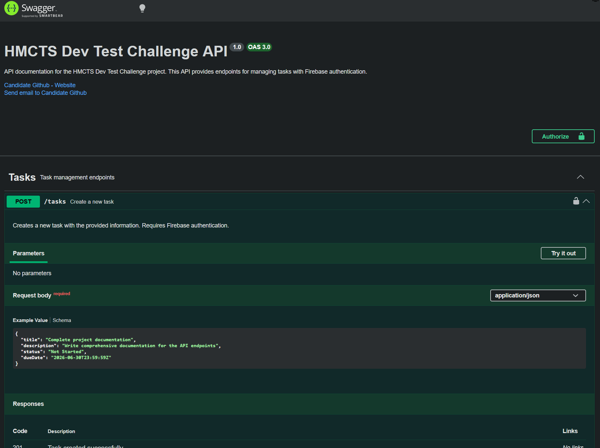
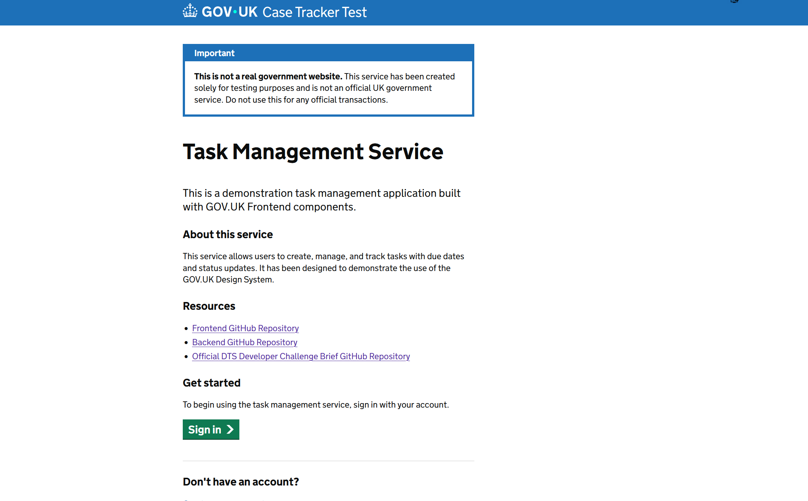
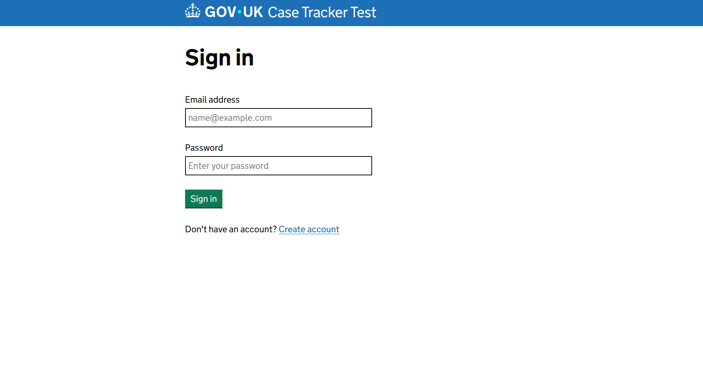
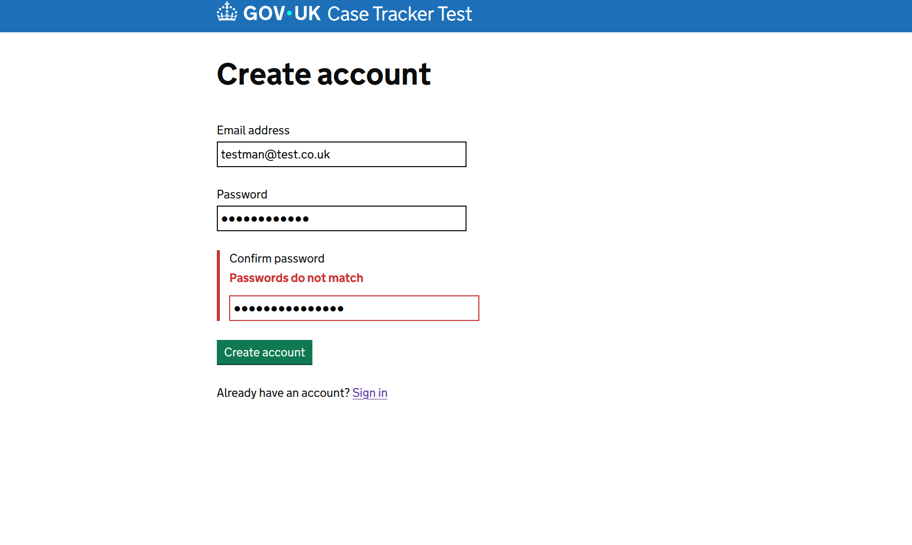
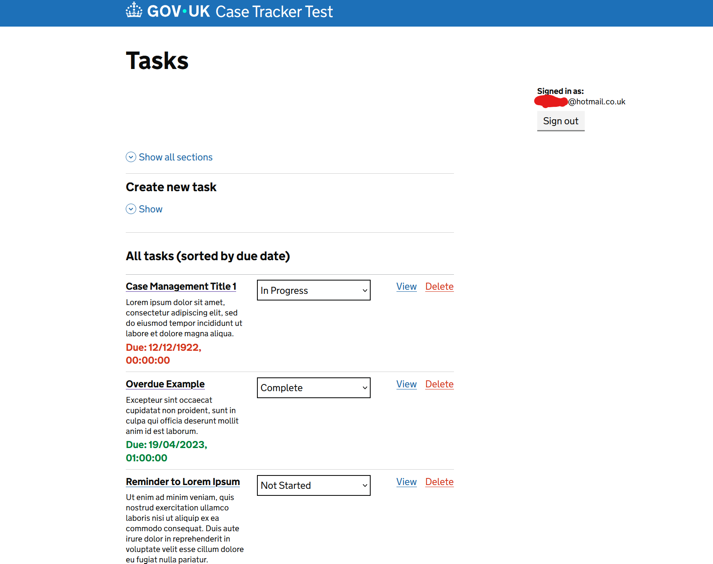
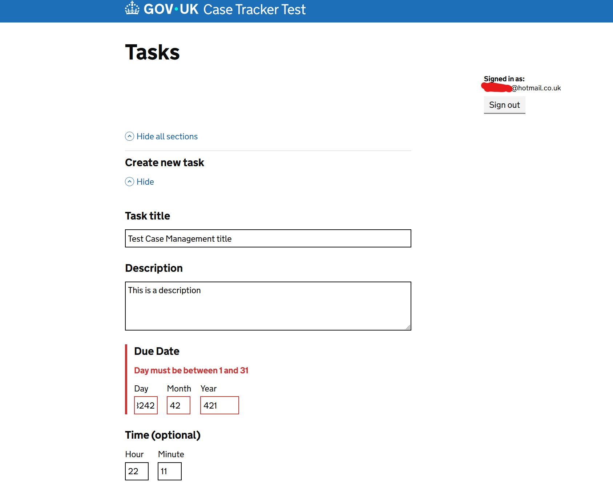
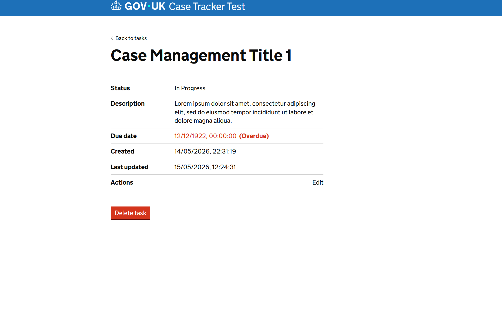
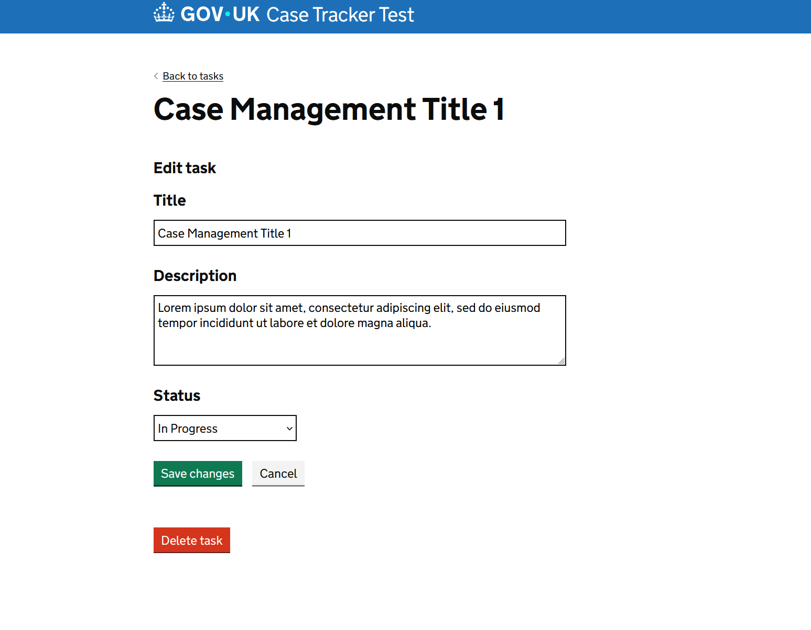

# GOV.UK Challenge - Custom Frontend

This frontend has been created with NextJS as part of the dts-developer-challenge. It implements a task management application with user authentication, form validation, and an accessible design using GOV.UK Frontend.

Parts of the GOV.UK Frontend library have been moved into the project root out of it's `node_modules` folder for compatibility with Tailwind and NextJS's engine.

## Tech Stack

-   **Framework**: Next.js 16.2.6
-   **Authentication and Database**: Firebase
-   **UI Components**: GOV.UK Frontend 6.1.0
-   **Node.js**: Built with 22.17.0
-   **npm**: Built with 10.9.2

## Important Links

### Github Repositories

-   [Backend API Repository](https://github.com/lewis1190/hmcts-dev-test-backend-nestjs)
-   [DTS Developer Challenge Brief](https://github.com/hmcts/dts-developer-challenge)

### Hosted Links via Heroku

-   [Frontend](https://gov-challenge-frontend-8729b9eaca16.herokuapp.com/)
-   [Backend](https://gov-challenge-backend-0b9a806832f0.herokuapp.com/)
-   [Backend API Documentation](https://gov-challenge-backend-0b9a806832f0.herokuapp.com/api)

### AI Clause

As this was my first time handling the GOV.UK frontend library, AI tools were used to increase efficiency when debugging unfamiliar code and unexpected issues, as well as code reviews for best practices. Predictive text was used to speed up the scaffolding of UI components.

## Features

-   **User Authentication**: Secure Firebase authentication with protected routes
-   **Task Management**: Create, read, update, and delete tasks with real-time status tracking
-   **Form Validation**: Comprehensive client-side validation with real-time error feedback
-   **Accessible Design**: Built with GOV.UK Frontend 6.1.0 for WCAG 2.1 compliance
-   **Responsive UI**: Mobile-first approach with GOV.UK styling
-   **Date/Time Input**: Flexible date and time input fields with validation, using the GOV.UK frontend styles with React's FormEvent handling.
-   **API Integration**: Communication with NestJS backend

## Project Structure

<details>

<summary>Click to view Project Structure</summary>

```
gov-frontend-custom/
├── app/
│   ├── globals.css              # Global styles
│   ├── layout.tsx               # Root layout
│   ├── page.tsx                 # Landing page
│   ├── login/
│   │   └── page.tsx             # Login page with validation
│   ├── signup/
│   │   └── page.tsx             # Signup page with password confirmation
│   └── tasks/
│       ├── page.tsx             # Task list and creation interface
│       ├── [id]/
│       │   └── page.tsx         # Individual task detail and editing
│       ├── helpers.tsx          # Validation utilities (date & time)
│       ├── enums/
│       │   └── task-status.enum.ts
│       └── interfaces/
│           └── task.interface.ts
├── components/
│   ├── AuthProvider.tsx         # Firebase auth context
│   ├── GovUKBanner.tsx         # GOV.UK banner component
│   └── GovUKInitializer.tsx    # GOV.UK Frontend initialization
├── lib/
│   └── firebase.ts              # Firebase configuration
├── public/
│   ├── govuk-frontend.min.css  # GOV.UK styles
│   └── assets/fonts/            # GOV.UK Transport fonts
└── Configuration files (tsconfig.json, next.config.ts, eslint.config.mjs, etc.)
```

</details>

## Project Screenshots

<details>

<summary>Click to view Screenshots</summary>


*1. Backend API Documentation with Swagger*


*2. Landing Page*


*3. Login Page*


*4. Create Account Page*


*5. Task List Page with Overdue Highlighting*


*6. Creating a Task with Date and Time Validation*


*7. Viewing a Specific Task*


*8. Editing a Specific Task*

</details>

## Getting Set Up Locally

### Prerequisites

Ensure you have the following installed:

-   Node.js 22.17.0 or later
-   npm 10.9.2 or later
-   A Firebase project with email/password authentication enabled
-   A NestJS backend API running (see backend repository)

### Installation

1. **Set up environment variables**:

   Copy `.env.local` to `.env` with your configuration:

   ```env
   # Firebase Configuration
   NEXT_PUBLIC_FIREBASE_API_KEY=your_api_key
   NEXT_PUBLIC_FIREBASE_AUTH_DOMAIN=your_project.firebaseapp.com
   NEXT_PUBLIC_FIREBASE_PROJECT_ID=your_project_id
   NEXT_PUBLIC_FIREBASE_STORAGE_BUCKET=your_project.appspot.com
   NEXT_PUBLIC_FIREBASE_MESSAGING_SENDER_ID=your_sender_id
   NEXT_PUBLIC_FIREBASE_APP_ID=your_app_id

   # Backend API
   NEXT_PUBLIC_API_BASE_URL=http://localhost:3001
   ```

2. **Install dependencies**:

   ```bash
   npm install
   ```

### Development

Start the development server:

```bash
npm run dev
```

The application will be available at `http://localhost:3000`

**User flows**:

-   Navigate to `/` for some basic information about the project
-   Navigate to `/login` to sign in
-   Navigate to `/signup` to create a new account
-   Use `/tasks` for the task management interface

### Building for Production

```bash
npm run build
npm start
```

## Key Implementation Details

### Form Validation

Form validation is implemented with real-time error feedback using GOV.UK error styling:

-   **Date Validation**: Day (1-31), Month (1-12), Year (1900-2100) with calendar validation
-   **Time Validation**: Hour (0-23), Minute (0-59) with optional time input

Validation logic is centralized in `app/tasks/helpers.tsx` for conciseness and readability.

### Authentication

Firebase authentication is managed through the `AuthProvider` context component:

-   Automatic route protection (unauthenticated users redirected to `/login`)
-   ID token generation for API requests
-   Secure sign-out functionality
-   Session persistence

### Task Management

Tasks include:

-   Full CRUD for tasks
-   Status tracking (Not Started, In Progress, Complete)
-   Overdue highlighting for tasks

## What I would add beyond the MVP

This project is an MVP of the features requested by the brief. If I were to continue working on this project in the future, I would add the following:

-   A thorough review of the GOV.UK frontend library to ensure best practices and optimal use of components and styles. Currently there may be a few inconsistencies with my implementation vs the guidelines set by the library.
-   Whilst the backend has automated tests, the frontend currently does not. Automated tests would help ensure the stability of the site and also flag any UI bugs.
-   Some files are quite large. Ideally the UI would be further split into components to improve readability.
-   JSDoc comments for all functions and components for readability.
-   Adding comments on complex snippets of code.
